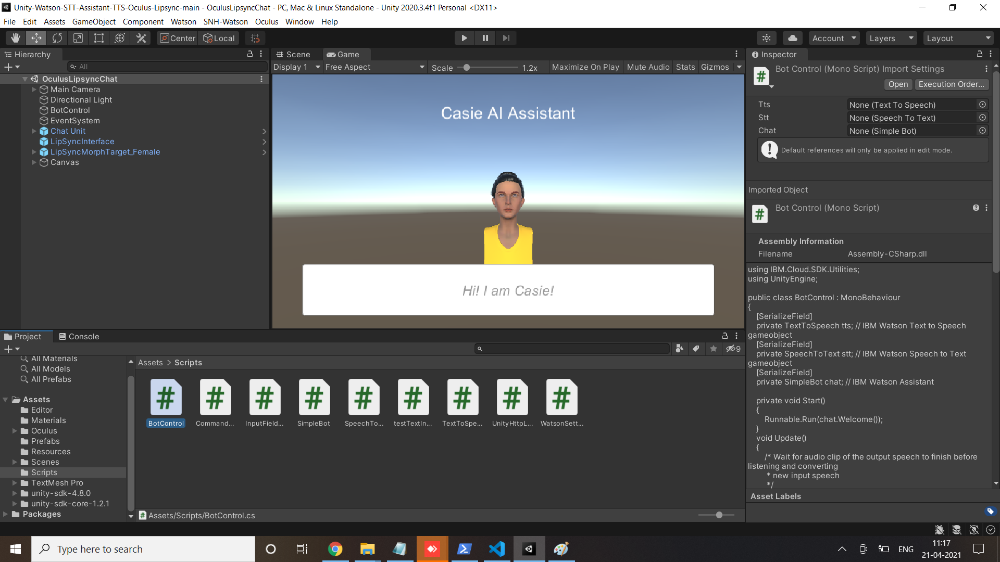

# Student Helper Unity 3D Chatbot

## Hack-a-Roo Spring 2021 Submission

### Team Ethnic Gems
* Srichakradhar Reddy
* Rohit Reddy

# Links

* [Demo](https://youtu.be/IPoA1alUIWI)
* [Watson Unity SDK](https://github.com/IBM/unity-sdk)
* [Unity Core SDK](https://github.com/IBM/unity-sdk-core)

# Sneak Peek


## Flow
* User interacts in augmented reality and gives voice commands such as "Walk Forward".
* The phone microphone picks up the voice command and the running application sends it to Watson Speech-to-Text.
* Watson Speech-to-Text converts the audio to text and returns it to the running application on the phone.
* The application sends the text to Watson Assistant. Watson assistant returns the recognized intent "Forward". The intent triggers an animation state event change.
* The application sends the response from Watson Assistant to Watson Text-to-Speech.
* Watson Text-to-Speech converts the text to audio and returns it to the running application on the phone.
* The application plays the audio response and waits for the next voice command.

## Description
It is the year 2020 and students are experiencing a new way of life when it comes to getting an education. Students are realizing they need to adopt a proactive and self-service mindset in to fulfill their academic needs. An intelligent chatbot that helps students find and access learning content supports this new self-service model. This pattern shows users how to build a self-service chatbot not only for education, but also for any other industries where users need to find information quickly and easily.

Using Watson Assistant, this pattern defines a dialog that a student and a course provider might experience as a student searches for learning content. Students can input grade-level and academic topics question, and the chatbot responds with course recommendations and learning content links. The conversation responses are further enhanced by using Watson Discovery and the Watson Assistant Search skill. Natural Language Understanding (NLU) is introduced in this pattern to complement Watson Discovery's accuracy by extracting custom fields for entities, concepts, and categories.

## 1. Pre-requisites

* [IBM Cloud Account](http://ibm.biz/Bdimr6)
* [Unity](https://unity3d.com/get-unity/download)
* [Node.js Versions >= 6](https://nodejs.org/): An asynchronous event driven JavaScript runtime, designed to build scalable applications.
* [Python V3.5+](https://www.python.org/downloads/): Download the latest version of Python
* [Pandas](https://pandas.pydata.org/): pandas is a fast, powerful, flexible, and easy-to-use open source data analysis and manipulation tool built on top of the Python programming language. 


## 2. IBM Cloud services

[IBM Cloud](https://cloud.ibm.com/):

1. [IBM Watson Speech-To-Text](https://cloud.ibm.com/catalog/speech-to-text/) service instance.
2. [IBM Watson Text-to-Speech](https://cloud.ibm.com/catalog/text-to-speech/) service instance.
3. [IBM Watson Assistant](https://cloud.ibm.com/catalog/services/conversation/) service instance.
4. [IBM Watson Natural Language Understanding (NLU) service](https://cloud.ibm.com/docs/services/natural-language-understanding?topic=natural-language-understanding-getting-started#getting-started)
5. [IBM Watson Discovery](https://cloud.ibm.com/catalog/services/discovery)

> **NOTE**: use the `Plus` offering of Watson Assistant. You have access to a 30 day trial.

### What is an Assistant Search Skill?

An Assistant search skill is a mechanism that allows you to directly query a Watson Discovery collection from your Assistant dialog. A search skill is triggered when the dialog reaches a node that has a search skill enabled. The user query is then passed to the Watson Discovery collection via the search skill, and the results are returned to the dialog for display to the user. Customizing how your documents are indexed into Discovery improves the answers returned from queries and what your users experience.

Click [here](https://cloud.ibm.com/docs/assistant-data?topic=assistant-data-skill-search-add) for more information about the Watson Assistant search skill.

### Why Natural Language Understanding (NLU)?

NLU performs text analysis to extract metadata such as concepts, entities, keywords, and other types of categories of words. Data sets are then enriched with NLU-detected entities, keywords, and concepts (for example, course names). Although Discovery provides great results, sometimes a developer finds that the results are not as relevant as they might be and that there is room for improvement. Discovery is built for "long-tail" use cases where the use case has many varied questions and results that you can't easily anticipate or optimize. Additionally, if the corpus of documents is relatively small (less than 1000), Discovery doesn't have enough information to distinguish important terms and unimportant terms. Discovery can work with a corpus this small - but it is less effective because it has less information about the relative frequency of terms in the domain. 


## Flow

 

1. Execute Python program to run data set through Natural Language Understanding to extract the meta-data (e.g. course name, desciption,etc) and enrich the `.csv` file
2. Run Node program to convert `.csv` to `.json` files (required for the Discovery collection)
3. Programmatially upload .json files into the Discovery Collection
4. The user interacts through the chatbot via a Watson Assistant Dialog Skill
5. When the student asks about course information, a search query is issued to the Watson Discovery service through a Watson Assistant search skill. Discovery returns the responses to the dialog


## 3. Configure Watson NLU

NLU enriches Discovery by creating the addition of metadata tags to your data sets.  In other words, includes terms that overlap with words that users might actually provide in their queries.

- The following instruction has the developer run the [`.csv`](./data/discovery-nlu/input) files through NLU and extract entities and concepts. Do this by running the python program:  
```bash
cd src
pip install watson-developer-cloud==1.5
pip install --upgrade ibm-watson
pip install pandas
sudo pip3 install -U python-dotenv
python NLUEntityExtraction.py
```


## 4. Configure Watson Discovery

Watson Discovery uses AI search technology to retrieve answers to questions.  It contains language processessing capabilities and can be trained on both structured and unstructured data. The data that Discovery is trained on is contained within what is called a `Collection` (aka Database).  You can learn more about Watson Discovery [here](https://www.ibm.com/cloud/watson-discovery?p1=Search&p4=p50290480283&p5=b&cm_mmc=Search_Google-_-1S_1S-_-WW_NA-_-%2Bwatson%20%2Bdiscovery_b&cm_mmca7=71700000060917569&cm_mmca8=aud-852729272088:kwd-302050444300&cm_mmca9=CjwKCAjw7-P1BRA2EiwAXoPWA2T6YMa5zifdlmrwND-h_LlXb1JGHM0lpIVgWxjr-a12Zs9isU4OuhoC0_oQAvD_BwE&cm_mmca10=405891754210&cm_mmca11=b&gclid=CjwKCAjw7-P1BRA2EiwAXoPWA2T6YMa5zifdlmrwND-h_LlXb1JGHM0lpIVgWxjr-a12Zs9isU4OuhoC0_oQAvD_BwE&gclsrc=aw.ds)

### Create Discovery Collection

### Configure Discovery:

1. Create a set of `.json` files that Discovery will consume for its collection.   The [node program](./src/read-file.js) converts the `.csv` file to a set of `.json` files in a directory named `manualdocs`.

-  Install [Node.js](https://nodejs.org) (Versions >= 6).

-  In the root directory of your repository, install the dependencies.
```bash
npm install
```

 - Run below command
 ```bash
 node read-file.js 
 ```
- Verify the [`JSON`](./data/manualdocs) files exists.

2. Programmatically upload the `.json` files into the discovery collection

> ensure you have added your Discovery credentials into a .env file sitting in your root directory of your repo.

```bash
 npm install python-dotenv
 npm install ibm-watson
 node upload-file.js 
 ```

## 3. Building and Running

> Note: This has been compiled and tested using Unity 2018.3.0f2 and Watson SDK for Unity 3.1.0 (2019-04-09) & Unity Core SDK 0.2.0 (2019-04-09).

The directories for unity-sdk and unity-sdk-core are blank within the Assets directory, placeholders for where the SDKs should be. Either delete these blank directories or move the contents of the SDKs into the directories after the following commands.

1. Download the [Watson SDK for Unity](https://github.com/watson-developer-cloud/unity-sdk) or perform the following:

`git clone https://github.com/watson-developer-cloud/unity-sdk.git`

Make sure you are on the 3.1.0 tagged branch.

2. Download the [Unity Core SDK](https://github.com/IBM/unity-sdk-core) or perform the following:

`git clone https://github.com/IBM/unity-sdk-core.git`

Make sure you are on the 0.2.0 tagged branch.

3. Open Unity and inside the project launcher select the  button.
4. If prompted to upgrade the project to a newer Unity version, do so.
5. Follow [these instructions](https://github.com/watson-developer-cloud/unity-sdk#getting-the-watson-sdk-and-adding-it-to-unity) to add the Watson SDK for Unity downloaded in step 1 to the project.
6. Follow [these instructions](https://github.com/watson-developer-cloud/unity-sdk#configuring-your-service-credentials) to create your Speech To Text, Text to Speech, and Watson Assistant services and find your credentials using [IBM Cloud](https://cloud.ibm.com)

**Please note, the following instructions include scene changes and game objects have been added or replaced for AR Foundation.**

7. In the Unity Hierarchy view, click to expand under `AR Default Plane`, click `DefaultAvatar`. If you are not in the Main scene, click `Scenes` and `Main` in your Project window, then find the game objects listed above.
8. In the Inspector you will see Variables for `Speech To Text`, `Text to Speech`, and `Assistant`. If you are using US-South or Dallas, you can leave the `Assistant URL`, `Speech to Text URL`, and `Text To Speech URL` blank, taking on the default value as shown in the WatsonLogic.cs file. If not, please provide the URL values listed on the Manage page for each service in IBM Cloud.
9. Fill out the `Assistant Id`, `Assistant IAM Apikey`, `Speech to Text Iam Apikey`, `Text to Speech Iam Apikey`. All Iam Apikey values are your API key or token, listed under the URL on the Manage page for each service.


### Building for iOS
Build steps for iOS have been tested with iOS 11+ and Xcode 10.2.1.

1. To Build for iOS and deploy to your phone, you can _File_ -> _Build_ Settings (Ctrl + Shift +B) and click Build.
2. When prompted you can name your build.
3. When the build is completed, open the project in Xcode by clicking on `Unity-iPhone.xcodeproj`.
4. Follow [steps](https://help.apple.com/xcode/mac/current/#/dev60b6fbbc7) to sign your app. Note - you must have an Apple Developer Account.
5. Connect your phone via USB and select it from the target device list at the top of Xcode. Click the play button to run it.
6. Alternately, connect the phone via USB and _File_-> _Build and Run_ (or Ctrl+B).

### Building for Android
Build steps for Android have been tested with Pie on a Pixel 2 device with Android Studio 3.4.1.

1. To Build for Android and deploy to your phone, you can _File_ -> _Build_ Settings (Ctrl + Shift +B) and click Switch Platform.
2. The project will reload in Unity. When done, click Build.
3. When prompted you can name your build.
4. When the build is completed, install the APK on your emulator or device.
5. Open the app to run.

# Troubleshooting

AR features are only available on iOS 11+ and can not run on an emulator/simulator. Be sure to check your player settings to target minimum iOS device of 11, and your Xcode deployment target (under deployment info) to be 11 also.

In order to run the app you will need to sign it. Follow steps [here](https://help.apple.com/xcode/mac/current/#/dev60b6fbbc7).

Mojave updates may adjust security settings and block microphone access in Unity. If Watson Speech to Text appears to be in a ready and listening state but not hearing audio, make sure to check your security settings for microphone permissions. For more information: https://support.apple.com/en-us/HT209175.

You may need the [ARCore APK](https://github.com/google-ar/arcore-android-sdk/releases) for your Android emulator. This pattern has been tested with ARCore SDK v1.9.0 on a Pixel 2 device running Pie.
